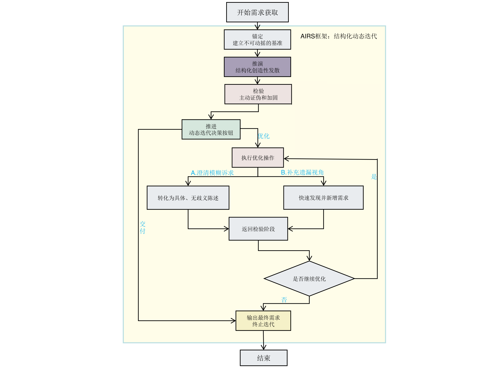

# AIRS
AIRS's framework description and experiment dataset

## AIRS's design background
AIRS's framework is used to elicite requirements.Existing frameworks and methods for requirements elicitation using large language models have been found to produce results that deviate significantly from the target requirements, suffering from issues such as incomplete requirements and low accuracy.

So,this paper proposed a framework called AIRS to achieve self review to elicite requirements which based on existing frameworks and methods as well as their limitations

## AIRS's specific content
AIRS is a method which is designed for complex requirements elicitation, It structures the requirements elicitation process into four core stages and through a human-AI collaborative closed-loop feedback mechanism to ensure the continuous optimization and refinement of the requirements solution.

Anchor: this period aims to establish a stable and unshakable baseline for the entire requirements elicitation process.It establishes a stable and consistent contextual foundation by explicitly defining the role of the large language model, its working context, the core intent to be addressed, the absolute constraints that must be followed, and measurable success criteria.This baseline which as a "reference anchor" to ensure that all subsequent inference and review activities remain focused on the defined objectives, prevent to occur the cognitive bias or scope creep during the dynamic iteration process effectively.

Infer: this period aims to structure the creactive activities based on the baseline of anchor's period. Its task is to decompose and expand requirements systematically from core dimensions such as functional behavior, user scenarios, and system boundaries, aiming to identify and supplement both explicit and implicit requirements necessary to fulfill the core intent.this process chooses the structured strategy which allow to explore deeply according to focus on key dimensions according to problem characteristics , and its production is a preliminary set of requirement solutions that pursue breadth,depth and structured.

Review: this period is a crucial step for the systematic evaluation and consolidation of the requirement solutions generated by the "inference" process.It conducts proactive review and stress testing on the solutions from multi-dimensional evaluation perspectives such as clarity, completeness, and requirement type coverage, aiming to identify problems including ambiguity, omissions, or dimensional deviations. Different from the passive review at the end of traditional processes, this stage is an active quality filtering carried out in the early iteration stage. Its output is a clear list of problems and optimization directions corresponding to the above perspectives, providing direct basis for decision-making.

Step Forward: as a descision-making hub for the dynamic iteration of the framework , Step Forwartd is based on the issues identified in the "Review" period which is executed the key operations by analyst: If optimization is selected, the specific defects identified in the verification stage will be revised, including converting vague demands into clear and unambiguous statements, or quickly identifying and supplementing missing perspectives and requirements. After optimization, it can re-enter verification or proceed to delivery. If the solution is confirmed to be robust, iteration is terminated and the final requirements are output, transforming the linear process into a closed-loop adaptive feedback system.

## AIRS's using case
In order to explain the practical working mechanism of AIRS more intuitively, this subsection is demonstrated how to gradually obtain a complete, clear, and verifiable requirement description list from scratch through multiple rounds of iteration by a case "School Course Selection Management System" which is used to requirements elicitation.This case is based on a real experiemnt process. However, for brevity, only the key steps and typical outputs are presented here.

### Anchor
First, the analyst clarifies the role, background, and task to the large language model:
Role: Senior Requirements Engineer
Background: A comprehensive university plans to develop a new School Course Selection Management System, and the project is in its earliest stage.
Task: In the subsequent deduction phase, simulate guided interviews with key stakeholders (students, instructors, and academic affairs administrators) to identify and document their original problems, operation processes, pain points, and expectations, and output a categorized requirement description list.
After the model confirms its understanding, the deduction phase can begin.

### Infer(Round 1)
The model simulates interviews with three types of stakeholders and outputs original feedback (excerpts): Flow Chart of the AIRS Framework
Undergraduate student: 
    "The course selection system often crashes when it opens at 9 a.m. By the time I can log in, all the popular courses are already full. I hope there will be a queue reminder."
Course teacher:
    "Entering grades requires copy-pasting, which easily leads to wrong rows. I hope batch import is supported."
Academic administrator: "Credit verification relies on manual checking, which is inefficient. I hope a built-in course substitution rule engine can be added."
The functional requirements output in this round are specific but not yet systematic.

### Review(Round 1)
Review the above feedback from three perspectives:
Clarity: Some expressions are overly broad, such as "intelligent" in "intelligent timetable arrangement", which needs to be specified; "real-time" in teachers' "real-time name list" also requires a clear definition.
Completeness: Key stakeholders (system operation and maintenance staff, departmental teaching secretaries, finance office, etc.) and scenarios (course add/drop rules, cross-major course selection, system integration, etc.) have been omitted.
Coverage of Requirement Types: Functional requirements are abundant, but non-functional requirements (such as performance and security), constraint requirements (such as regulations and integration requirements), and quality attribute requirements are almost blank.
Conclusion: Not ready for delivery; further optimization is required.

### Step Forward and optimization(Round 1)
According to the verification results, the analyst decides to optimize and instructs the model to:
Clarify ambiguous items (e.g., convert "intelligent scheduling" into specific rules: no conflicts in teacher availability, no overlapping classroom usage, etc.).
Supplement missing roles and scenarios (simulate interviews with operation and maintenance staff, teaching secretaries, finance office personnel, etc.).
After the model execution, the updated list is output, which newly adds the monitoring requirements of operation and maintenance staff, the curriculum management requirements of teaching secretaries, the payment linkage requirements of the finance department, etc., and specifies the ambiguous items.

### Review and Optimization and Iteration(Round 2)
A re-verification revealed that:
The newly added roles are still incomplete (e.g., counselors, librarians, data administrators, etc., are missing).
Some business rules are still not fully closed-loop (e.g., the timing of quota release after course withdrawal, supplementary selection priority, and the process for course cancellation).
Non-functional requirements still lack quantitative indicators (such as concurrency, response time, availability, etc.), and constraint requirements have not been systematized.
Therefore, a second round of optimization was carried out, supplementing the counselor view, library resource synchronization, data reports, atomic course change operations, multi-level approval chains, etc. Non-functional indicators (such as supporting 15,000 concurrency, core transaction response < 2 seconds, etc.) and constraints (such as Class II Cybersecurity Protection, MySQL 8.0, etc.) were jointly defined with technical experts.

### Final Review and Delivery
After multiple rounds of iteration, the final list covers all core stakeholders including students, teachers, academic affairs personnel, operation and maintenance staff, teaching secretaries, finance personnel, counselors, librarians, and data administrators. The functional requirements are detailed, non-functional requirements are quantified, constraint requirements are complete, and quality attributes are clear. Verification shows there are no ambiguous items or major omissions, and all four types of requirements are fully reflected. Thus, it enters the delivery phase, and the List of Requirement Descriptions for the School Course Selection Management System is output (partial examples are as follows):
[Functional Requirements] The system shall provide real-time queuing notifications during peak course selection periods, displaying the current position and estimated waiting time.
[Functional Requirements] The system shall support the atomic operation of "course change". Upon confirming no conflicts and available quotas, the system shall complete course withdrawal and new course selection synchronously within 2 seconds.
[Non-Functional Requirements] During peak course selection periods, the system shall support 15,000 concurrent users, with 95% of core transactions having a response time of less than 2 seconds.
[Constraint Requirements] The system must pass the Class II Cybersecurity Protection evaluation, and students' sensitive information shall be stored in encrypted form.
[Quality Requirements] When academic policies are adjusted, the effort required to modify core rules shall be completed within 2 person-months.

## Experiment Description in Thesis
To verify the adaptability of the AIRS framework on models with different capabilities, this experiment selects DeepSeek, which excels in code reasoning, and Qwen3-Max, which performs prominently in Chinese instruction following, as the basic large language model platforms. The experimental task focuses on the requirements elicitation of the classic "school course selection management system". The prompts of all methods are constructed in strict accordance with the standard paradigms defined in their respective original literatures. For the AIRS framework proposed in this paper, we design structured prompt templates for its four core stages (Anchoring, Inference, Review, Step Forward), and the prompts of each stage directly start with the instructions and format requirements of that stage. For methods and frameworks such as Chain-of-Thought, Self-Ask, ReAct, CRISPE and ROSES, we compile prompts starting with corresponding task instructions (e.g., "Please use the chain-of-thought method to think step by step and output requirements") according to their accepted paradigms. All methods aim to guide the model to conduct requirements elicitation for the "school course selection management system" from scratch. The experiment includes three comparative experiments: framework comparison experiment, horizontal comparison experiment, and vertical comparison experiment (ablation experiment). The goal is to obtain high-quality requirements through interaction with large models.

To ensure the objectivity and practical relevance of the evaluation, we constructed a golden standard requirements set. The construction of this set integrates two sources: first, combining classic software engineering theories, we designed targeted questions to guide large language models in requirement generation; second, we systematically crawled and analyzed real requirement descriptions from issues, pull requests, and project documents of multiple related projects on open-source platforms such as Gitee. Through systematic sorting and deduplication of these sources, we finally summarized a clear and structured set of requirement descriptions, covering functional requirements, non-functional requirements, constraint requirements, and quality requirements that the system must implement. On this basis, combined with traditional requirements engineering evaluation methods and the requirements engineering dataset LLM-Generated Software Requirements, we determined four appropriate evaluation metrics: clarity, consistency, verifiability, and completeness. All evaluation metrics are calculated by automated scripts. Among them, consistency and completeness rely on semantic similarity calculation between generated requirements and golden requirements: we use the Sentence-BERT framework to load the Chinese-oriented BGE model to vectorize requirement texts, and obtain matching scores through cosine similarity; a similarity ≥ 0.7 is regarded as a matched requirement, and then completeness (number of matched requirements / total number of golden requirements) and consistency (average similarity of all matched requirements) are calculated. Clarity and verifiability are implemented based on rules: clarity is obtained by calculating the proportion of fuzzy words after jieba word segmentation and matching with a fuzzy word dictionary, and verifiability is mapped to scores by matching verifiable features (such as numerical units, comparison operators, etc.) through regular expressions. The evaluation system first extracts 205 requirements from the JSON-formatted golden requirements set as the benchmark, then parses and vectorizes the requirements generated by each method, and finally calculates the scores of the four metrics in batches.

(For detailed experimental results, please refer to the content under the experiment folder.)